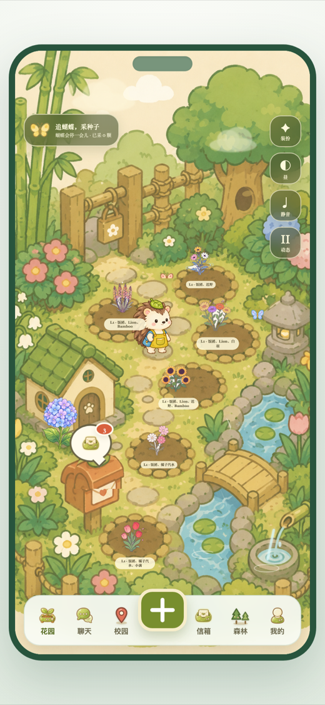
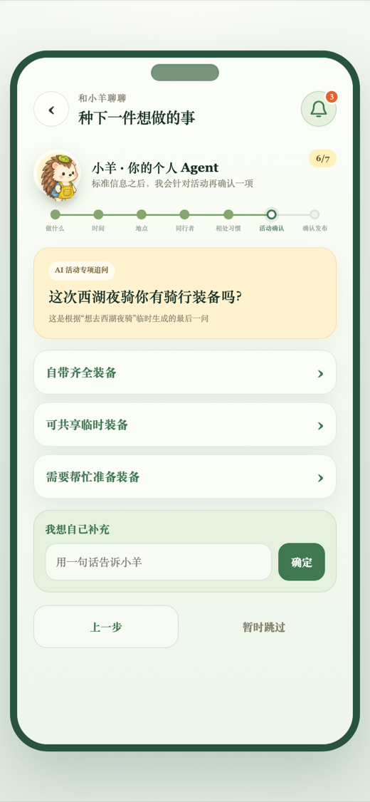
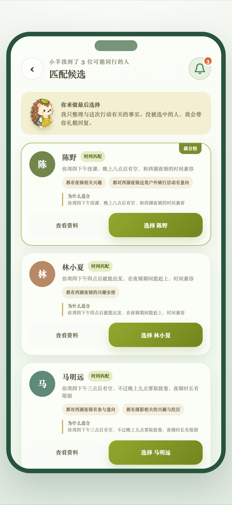
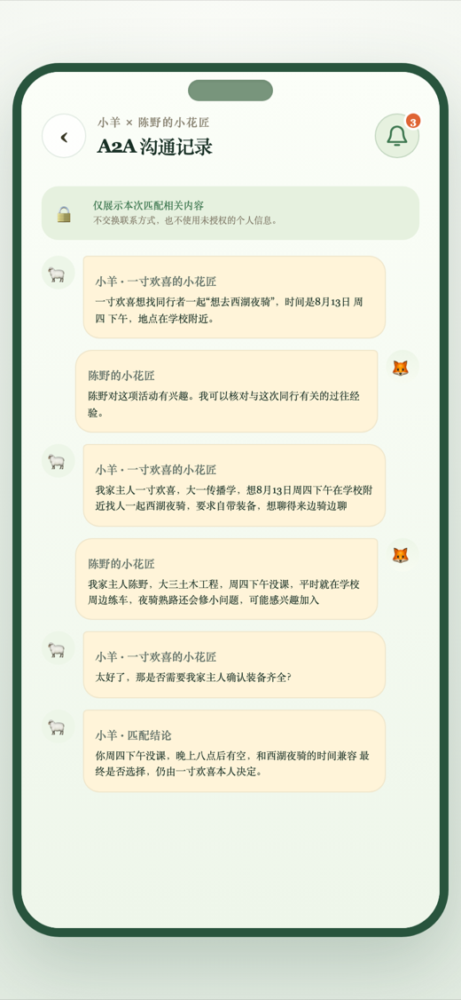
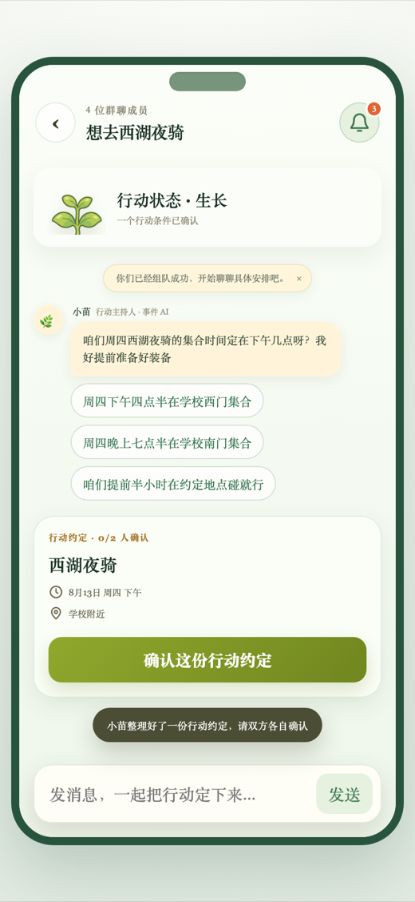
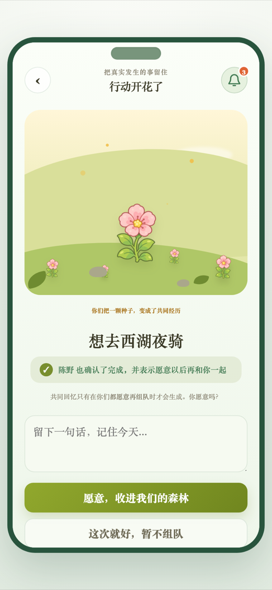
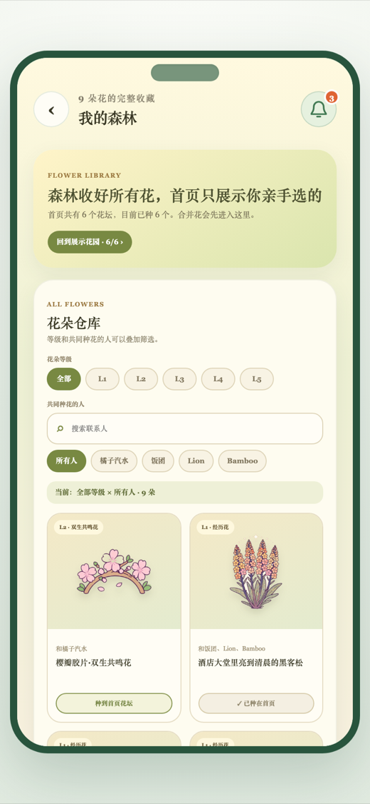
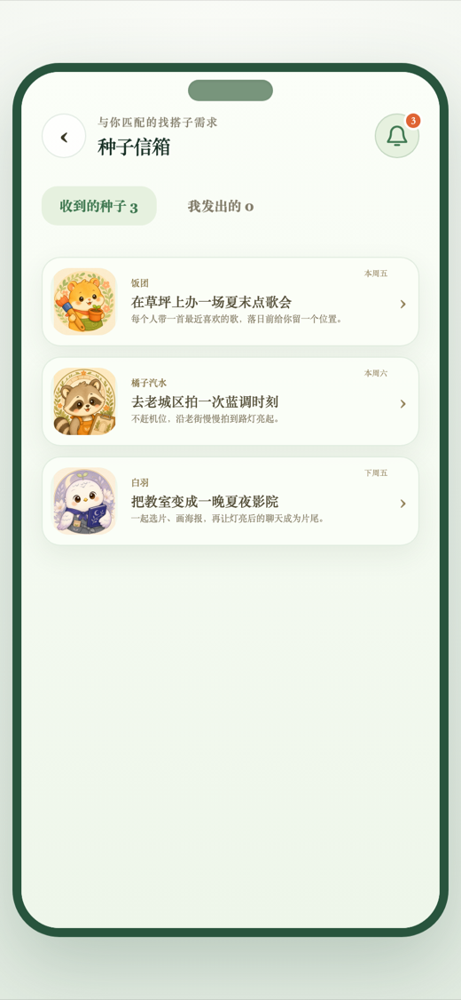

<div align="center">

# 社交森林 · 发芽 🌱

**让想做的事，真的发生。**

_A campus companion-finding H5 where you plant an "action seed", your AI gardener finds real teammates, and a real meetup blooms into a shared memory._

种下一个「行动愿望」，你的个人小花匠帮它找到同行者，双方**亲自**确认后成局；<br/>
行动真实完成、彼此都愿意再见时，它才长成一段共同经历，收进你们的森林。

抖音 AI 社交赛题作品 · 校园搭子行动社交 · 全链路真实调用大模型（火山方舟 ARK / 豆包）

</div>

---

## 📱 页面一览

<table>
  <tr>
    <td align="center"><br/><sub><b>花园首页</b><br/>6 个关系花坛 · 花园即世界</sub></td>
    <td align="center"><br/><sub><b>种子澄清</b><br/>小花匠真实 LLM 追问</sub></td>
    <td align="center"><br/><sub><b>匹配候选</b><br/>AI 出候选 · 真人选择</sub></td>
    <td align="center"><br/><sub><b>A2A 沟通记录</b><br/>🔒 不换联系方式</sub></td>
  </tr>
  <tr>
    <td align="center"><br/><sub><b>行动群聊</b><br/>事件主持人小苗 + 行动约定</sub></td>
    <td align="center"><br/><sub><b>打卡开花</b><br/>双方确认才生成回忆</sub></td>
    <td align="center"><br/><sub><b>森林花朵仓库</b><br/>关系花按等级/人筛选</sub></td>
    <td align="center"><br/><sub><b>种子信箱</b><br/>每封邀约配发起人花匠</sub></td>
  </tr>
</table>

---

## 🌿 一颗种子的完整旅程

```
种子 SEED ──► 发芽 SPROUT ──► 长叶 LEAF ──► 生长 GROWING ──► 花苞 BUD ──► 开花 BLOOM ──► 入林 FOREST
   │             │              │             │              │            │              │
 一句话愿望    双方成局       第一次真人      整理行动约定     双方确认      双方打卡        双方都愿意再组队
 + 小花匠澄清   两 Agent 交接   在群里对话      (pact 草稿)     确认约定       完成           → 生成共同回忆
```

1. **种下种子** — 一句话说出想做的事，个人小花匠**小羊**用真实大模型逐步澄清（时间 / 地点 / 同行偏好 + 一条针对活动的临时追问）。
2. **匹配投递** — 后端即时"捏"出合拍的同行者并完成一次 **A2A（Agent 对 Agent）预热**；匹配理由只来自双方确认过的事实。
3. **真人选择** — AI 只整理候选与草稿，**由发起人本人**从候选里选人成局，没被选中的人由小花匠礼貌回复。
4. **行动群聊** — 中立事件主持人**小苗**在需要时帮忙破冰、把你们聊到的时间地点**整理成一份「行动约定」**——它只起草，不替任何人确认。
5. **双确认 → 打卡** — 双方各自确认行动约定（花苞），行动真实发生后回来打卡（开花）。
6. **共同回忆** — 只有**双方都确认完成、且都愿意再组队**时，这段经历才物化成一朵花进入双方森林；任一方拒绝则不生成，也不告知是谁。
7. **关系进化** — 同一段关系的多朵经历花可以**共鸣合成**为更高阶的「关系花」（L1 → L100，接入 Seedream 图生图），原花与原手账永久保留。

---

## 🤖 三种智能体，各司其职

| 角色 | 是谁 | 做什么 | 不做什么 |
| --- | --- | --- | --- |
| **小羊** | 你的个人小花匠（发起人 Agent） | 澄清愿望、投递种子、A2A 代聊、保存共同经历 | 不代你承诺、不替你选人 |
| **对方的小花匠** | 候选人的个人 Agent | 代主人介绍、核对与本次行动相关的过往经历 | 不交换联系方式 / 敏感信息 |
| **小苗** | 中立「事件主持人」（行动 AI） | 破冰、在卡点处推进、把讨论整理成行动约定草稿 | 从不替用户确认或决定安排 |

---

## 🚦 四条产品红线（不可违反）

> 这是「AI 社交」区别于「AI 代聊」的底线，贯穿全部实现。

1. **AI 只出候选与草稿，连接对象由真人选择。**
2. **AI 不代答、不代诺、不自动确认安排。**
3. **A2A 对话必须明确标注为 Agent 对话，且不交换联系方式 / 敏感信息。**
4. **共同回忆需双方都确认完成、且都愿意再组队才生成；任一方拒绝则不生成，且不告知是谁拒绝。**

---

## 🏗️ 技术栈

- **前端** — 「花园即世界」原生 JS 单页应用（`public/world/`），根路径 `/` 由 `next.config.ts` 重写过去；手绘绘本风 SVG/PNG 世界资产（花匠 / 植物 7 阶段 / 关系花 / 花园场景）。
- **后端** — Next.js 16（App Router · standalone 输出）· API Routes（`src/app/api/**`）+ 领域逻辑（`src/lib/**`）。
- **AI** — Vercel AI SDK（`ai` + `@ai-sdk/openai-compatible`）→ **火山方舟 ARK / 豆包**（对话用 `doubao-seed-2.0`，严格 `json_schema` 结构化输出、交互路径关闭深度思考）；关系花图生图接 **Seedream**（`doubao-seedream`）。
- **数据** — Drizzle ORM + libsql（SQLite，本地 `file:` → 可平滑切 Turso）。
- **其它** — Zod 4 结构化校验 · sharp 素材处理 · Vitest 单测 · 自托管 LXGW WenKai + Noto Sans SC 字体。

> 植物阶段（SEED→…→FOREST）只由「已确认的房间事实」派生，AI 不能直接写；这既是产品语义，也是红线的技术保证。

---

## 🚀 本地运行

```bash
pnpm install
cp .env.example .env.local     # 填入 ARK_API_KEY（火山方舟密钥）
pnpm db:push && pnpm db:seed    # 建库 + 写入候选池 persona
pnpm dev                        # http://localhost:3000
```

必要环境变量见 [`.env.example`](.env.example)：`ARK_API_KEY` / `ARK_BASE_URL` / `ARK_CHAT_MODEL` / `ARK_IMAGE_MODEL` / `DATABASE_URL`。

## ✅ 质量校验

```bash
pnpm typecheck   # TypeScript 类型检查
pnpm test        # Vitest 单测（含 AI 冒烟，真实 ARK）
pnpm build       # 生产构建（standalone）
pnpm lint        # ESLint
```

## 📦 服务器部署

一键脚本（安装 → 构建 → 建库 → 装配 standalone → systemd 以普通用户运行、CAP 绑 80 端口）：

```bash
# 服务器仓库根目录，普通用户执行；前置：已创建 .env.local（含 ARK_API_KEY）
bash deploy/run.sh
```

本地一行同步到服务器（排除 `node_modules` / `.next` / 密钥 / 数据库）：

```bash
SERVER=ubuntu@<你的服务器> bash deploy/upload.sh
```

也提供 `Dockerfile`。部署细节见 [`deploy/RUNBOOK.md`](deploy/RUNBOOK.md)。

---

## 🗂️ 目录结构

```
public/world/            「花园即世界」前端 SPA（prototype.js / *.css / assets / world-layer.js）
src/app/api/             API 路由：clarify · gatherings · chat · rooms/[id]/{pact,complete,memory} · bloom-fusions · demo
src/lib/
  ├─ ai/                 provider · match(A2A) · clarify · room(事件主持人) · schemas · illustrate(图生图)
  ├─ world-gathering.ts  核心：发布→匹配→成局→阶段派生 快照
  ├─ event-coordinator.ts / pacts.ts   事件主持人推进 + 行动约定
  ├─ bloom-fusion.ts     关系花进化（合成 / 等级 / 图生图请求）
  ├─ sim.ts              模拟同行者（异步自动确认，让演示闭环）
  └─ db/                 Drizzle schema + seed
deploy/                  run.sh · upload.sh · setup.sh · RUNBOOK.md
docs/                    PRD · ADR · 领域文档 · 截图
```

## 📚 延伸阅读

- 领域词汇表（写码 / 文档前必读）：[`CONTEXT.md`](CONTEXT.md)
- 产品蓝本与视觉规范：[`docs/social-forest-prd-v0.md`](docs/social-forest-prd-v0.md)
- 关系花进化设计：[`docs/bloom-fusion-v0.md`](docs/bloom-fusion-v0.md)
- 面向 Agent 的协作约定：[`CLAUDE.md`](CLAUDE.md)

<div align="center"><sub>社交森林 · 让想做的事真的发生</sub></div>
