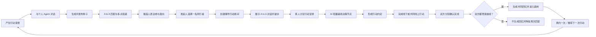

# 行动森林：产品功能链路

> 版本：V0.1  
> 日期：2026-08-12  
> 文档目的：从宏观层面说明产品定位、核心对象、完整用户链路与关键业务规则。  
> 首版范围：移动端、校园用户、1 对 1 搭子场景。

## 1. 产品概述

### 1.1 产品定义

行动森林是一款专注于推动真实共同行动发生的社交产品。

它不以“匹配成功”或“双方开始聊天”为终点，而是持续帮助两名用户完成破冰、跨过行动安排中的关键决策节点，把“有机会一起”推动成一项明确约定，再把约定转化为一次真实发生的行动。

第一次行动完成后，产品将双方愿意保留的共同经历沉淀进个人花园，并通过“再约一次”、原搭子优先和相似机会推荐，持续推动下一次行动发生。

### 1.2 一句话介绍

> 用户种下一颗行动愿望，AI 帮助它找到同行者、完成破冰、跨过关键决策，并最终长成一段真实发生且能够延续的共同经历。

### 1.3 核心价值

产品解决的首要问题是：

> 成为搭子以后，如何推动一次真实的共同行动，并让这种行动持续发生下去？

核心卡点有两个：

1. **破冰困难**：双方已经匹配，但不知道如何自然开始第一次交流。
2. **行动安排难以形成**：双方在时间、地点、选择方案等决策节点上迟迟无法形成结论，最终停留在口头意愿。

产品对应提供三项能力：

1. **AI 帮助破冰**：利用匹配阶段的 A to A 对话和双方共同点，为真人提供自然的第一句话。
2. **AI 轻量推动进度**：只在具体决策节点上总结、给出有限选项或提出下一步，不替用户规划整场行动。
3. **植物可视化进度**：种子、发芽、花苞和开花分别表达事件所处阶段，让原本不可见的行动进展变得可感知。

## 2. 产品的核心对象

### 2.1 事件是核心，而不是人际匹配

产品以“用户想共同完成的一件事”为核心对象。

- 用户不是为了认识一个抽象的人而进入产品，而是为了完成一件具体的事。
- 匹配人的目的，是帮助事件找到同行者并成局。
- 聊天、AI 介入、植物成长和共同回忆都从属于事件。
- 关系由共同完成的真实事件自然产生，而不是先建立关系再寻找事情。

### 2.2 核心概念及其映射

| 概念 | 产品含义 | 功能职责 |
|---|---|---|
| 用户 | 行动的发起者或候选同行者 | 发布需求、回应种子、讨论并完成行动 |
| 个人 Agent | 代表单个用户的 AI | 澄清需求、参与 A to A 匹配、传递种子 |
| 种子 | 尚未发生的行动愿望 | 承载“做什么、大致时间地点、搭子要求” |
| 种子信箱 | 接收行动机会的区域 | 展示 Agent 投递来的种子并收集参与意向 |
| 事件 | 两人围绕一件事形成的共同空间 | 承载对话、行动约定、状态和完成结果 |
| 事件 AI | 服务于一个事件的 AI | 破冰、辅助决策、整理行动约定 |
| 植物 | 事件进度的视觉化表达 | 让双方看到事件从意愿到完成的变化 |
| 花园／森林 | 用户真实经历的集合 | 展示完成的行动，承接回忆与再次发起 |
| 共同回忆 | 双方都同意保留的事件记录 | 沉淀照片、文字和共同经历 |

## 3. 产品设计原则

### 3.1 推动行动，而不是制造聊天

消息数量、聊天时长和表面活跃不是产品目标。AI 的每次介入都应服务于破冰、明确选择或促成约定。

### 3.2 真人作决定，AI 只提供辅助

AI 可以总结现状、提取共识、整理选项和给出建议，但不能替用户决定同行者、时间、地点或是否继续关系。

### 3.3 世界观必须对应真实功能

种子、植物和森林不是装饰：种子对应需求，生长对应事件进展，开花对应真实完成，森林对应共同经历。

### 3.4 事件信息优先于个人标签

页面首先回答“这件事是什么、能否参与、下一步是什么”，个人信息只展示与本次事件相关的部分。

### 3.5 关系延续必须尊重双方意愿

只有双方都愿意继续，事件才生成共同回忆并进入双方森林。任意一方拒绝，都不公开原因、不生成共同回忆，并降低后续再次匹配概率。

## 4. 宏观功能链路

## 5. 完整用户链路

### 5.1 阶段一：发布行动需求

#### 用户目标

快速表达“我想和别人一起做什么”，不填写冗长表单。

#### 流程

1. 用户点击底部中央的发布按钮。
2. 个人 Agent 询问用户想做什么。
3. 用户从少量动态选项中选择最接近的行动意愿；无法覆盖时可用一句短输入补充。
4. Agent 每次只追问一个当前缺少的必要信息，并继续提供少量选项。
5. Agent 生成行动种子卡，用户确认后发布。

#### 种子首版必要信息

- 做什么。
- 大致时间。
- 大致地点或范围。
- 对搭子的必要要求。

#### 核心规则

- 种子描述的是行动，不是交友宣言。
- 必要条件与“可以商量”的条件需要区分。
- 具体方案不要求在发布阶段全部确定，细节由双方成局后讨论。
- 用户确认前，Agent 不得代表用户发布。

### 5.2 阶段二：A to A 匹配与种子投递

#### 目标

让同一颗行动种子触达多名真正可能参与的人。

#### 流程

1. 发布方个人 Agent 根据种子寻找候选用户。
2. 发布方 Agent 与候选方 Agent 进行 A to A 对话。
3. 双方 Agent 仅交换与本次事件有关、且允许对外使用的信息。
4. 符合基本条件的种子被投递到多名候选用户的种子信箱。

#### A to A 对话的职责

- 判断时间、地点、兴趣或经验等基本条件是否适配。
- 找出双方与事件有关的共同点。
- 为后续真人破冰准备素材。

#### A to A 对话的边界

- 不替用户承诺参与。
- 不替用户决定时间、地点或行动方案。
- 不交换联系方式和敏感信息。
- 不使用未经用户允许的隐私信息。
- 不将 AI 推断包装成用户明确表达的事实。

### 5.3 阶段三：候选人回应与发起人选择

#### 候选人侧

1. 候选人在种子信箱查看行动种子。
2. 页面完整展示行动信息，有限展示发起人信息。
3. 候选人选择“愿意参与”或“暂不感兴趣”。
4. 选择愿意参与时，可附带一句可选留言。

“愿意参与”只代表成为候选搭子，不代表已经正式加入事件。

#### 发起人侧

1. 发起人收到多名候选人的参与意向。
2. AI 根据必要条件和本次事件相关信息进行排序与解释。
3. 发起人亲自选择一名同行者。
4. 双方正式成局，种子停止继续匹配。
5. AI 礼貌通知其他候选人本次种子已经找到同行者。

#### 核心规则

- 首版每个事件只选择一名搭子，即发起人与同行者组成 1 对 1 事件。
- AI 不能替发起人做最终选择。
- 不向候选人展示排名、竞争人数或最终被选择者。
- 拒绝文案不表达“你不合适”，只说明种子已经找到同行者。

### 5.4 阶段四：成局与 Agent 交接

#### 目标

让双方在了解“为什么匹配”的基础上开始真人交流，同时避免 AI 替用户聊天。

#### 流程

1. 发起人选定同行者后，系统创建事件行动房间。
2. 页面顶部展示对方信息摘要卡。
3. 聊天历史顶部展示经过整理的 A to A 对话。
4. 系统明确提示“两位 Agent 已完成交接”。
5. 两名真人自行开始对话；遇到具体卡点时可主动请小苗帮忙。

#### 对方信息摘要内容

- 与本次事件有关的特点和经验。
- 双方共同点。
- 本次匹配仍需进一步沟通的事项。

#### 核心规则

- A to A 内容需要明确标记为 Agent 对话。
- 默认展示简短可读版本，并允许折叠。
- A to A 内容只解释匹配依据，不替真人提出开场问题。
- 不提供预设快捷回复，不替用户生成第一句话。
- 小苗在此阶段默认不主动发言。

### 5.5 阶段五：真人讨论与 AI 轻量推进

#### 目标

帮助双方跨过行动安排中的具体决策节点，但不把聊天变成项目管理。

#### 真人职责

- 提出偏好和约束。
- 讨论行动方案。
- 对时间、地点和关键安排作出决定。

#### AI 职责

- 总结当前讨论到哪里。
- 在双方卡住时整理有限选项。
- 提取双方已经形成的共识。
- 在信息足够时建议整理成行动约定。

#### 首版触发方式

- 用户点击聊天输入框旁的“请小苗帮忙”，主动请求 AI 帮助。
- AI 根据当前对话只处理眼前一个卡点。
- 后续可增加非打扰式提示，但不在首版主动频繁插话。

#### 核心规则

- AI 一次只辅助一个决策节点。
- AI 最多给出少量选项，并保留“继续聊聊”。
- AI 不生成一份要求用户逐项完成的完整行动方案。
- AI 不根据一句含糊的“应该可以”自动确认安排。
- 用户可以随时修改已讨论的结论。

#### 真人与 AI 的职责边界

| 阶段 | AI 负责 | 真人负责 |
|---|---|---|
| 匹配完成、尚未开聊 | 展示 A to A 交接内容和双方共同点 | 决定如何开始交流 |
| 正常讨论 | 默认退到后台 | 自由聊天，表达偏好和限制 |
| 出现具体卡点 | 被主动召唤后总结分歧、整理选项或提出一个建议 | 判断建议是否有用，继续讨论或采纳 |
| 形成安排 | 整理双方已经说过的共识 | 确认时间、地点和所有实质选择 |

首版不由事件 AI 主动替双方开场，也不替真人生成快捷回复。个人 Agent 完成交接后，第一次真人消息应由用户自己发出。AI 的价值体现在需要时帮助双方越过卡点，而不是代替双方完成交流。

### 5.6 阶段六：形成行动约定

#### 目标

把“我们可以一起做”转化为“我们已经明确怎么做”。

#### 流程

1. 双方在聊天中逐渐形成足以执行的共识。
2. 用户主动请求，或 AI 建议将现有共识整理成行动约定。
3. AI 只整理双方已经谈过的内容，不补充未经讨论的决定。
4. 双方确认行动约定。
5. 约定固定在行动房间顶部，植物进入花苞状态。

#### 行动约定的最小条件

- 明确要共同完成的行动。
- 明确行动发生的时间或时间范围。
- 明确行动地点、集合方式或线上参与方式。
- 影响行动发生的必要备注。

不同活动需要确认的细节可以不同，但交互方式保持一致：真人讨论，AI 在节点上辅助并整理结论。

### 5.7 阶段七：真实行动与双方完成确认

#### 流程

1. 行动约定形成后，事件进入“等待行动”状态。
2. 行动发生后，双方分别点击“已完成”。
3. 只有双方都确认后，事件才进入完成后的回忆与评价阶段。

#### 核心规则

- 首版使用双方手动确认，不依赖定位或强制上传照片。
- 照片是可选的回忆素材，不是完成证明。
- 一方未确认时，事件保持“等待对方确认”。
- 若实际未完成，应允许继续讨论、修改约定或结束事件。

### 5.8 阶段八：私密评价与共同回忆

#### 用户可提交的内容

- 照片，可选。
- 一段自己的文字记录，可选。
- 是否愿意再次与对方组队，必选。
- 与本次同行体验有关的评价标签或私密备注，可选。

#### 共同回忆生成规则

- 只有双方都确认行动完成，并且双方都愿意再次组队，才生成共同回忆。
- 共同回忆同时进入双方的森林。
- 双方分别管理自己上传的照片和文字，不能修改对方内容。
- 任意一方不愿意继续，则双方都不生成公开共同回忆。
- 对方不会获知是谁选择了“不愿意继续”。
- 系统后台仅保留必要的完成与安全记录，并降低两人再次匹配概率。

### 5.9 阶段九：进入森林与再次行动

#### 森林的职责

1. 展示用户真实完成过的行动。
2. 保存双方共同同意留下的回忆。
3. 成为下一次行动的发起入口。

#### 再约一次

用户从某棵已完成的植物进入共同回忆后，可以点击“让它结出新种子”：

1. 系统继承原活动类型和原搭子。
2. 用户修改新的时间及必要条件。
3. 对方收到定向邀请。
4. 对方接受后创建新的事件，上一段经历不被覆盖。

## 6. 事件与植物状态

| 事件状态 | 产品含义 | 植物表达 | 进入条件 | 可执行动作 |
|---|---|---|---|---|
| 草稿 | 用户正在与 Agent 澄清需求 | 未成形的种子 | 尚未确认发布 | 修改、发布、退出 |
| 匹配中 | 种子已投递，等待参与意向 | 种子 | 用户确认发布 | 查看候选、取消 |
| 已成局／破冰中 | 已选择同行者，进入行动房间 | 发芽 | 双方完成选择确认 | 查看 A to A、开始聊天 |
| 讨论中 | 双方正在安排具体行动 | 长叶 | 真人开始有效交流 | 聊天、请求 AI 推进 |
| 已约好 | 已形成可执行的行动约定 | 花苞 | 双方确认行动约定 | 查看约定、修改、等待行动 |
| 待完成确认 | 行动时间已到或任一方点击完成 | 待开放花朵 | 一方确认完成 | 等待另一方确认 |
| 已完成 | 双方确认真实行动完成 | 开花 | 双方均确认完成 | 添加回忆、私密评价 |
| 已沉淀 | 双方同意保留共同回忆 | 森林中的成熟植物 | 双方均愿意继续 | 查看回忆、再约一次 |
| 已结束不沉淀 | 事件结束但不生成共同回忆 | 不进入森林 | 任意一方不愿继续 | 无公开回忆，减少再次匹配 |

植物成长不依据消息数量，而依据事件是否跨过了真实阶段。

## 7. AI 角色划分

### 7.1 个人 Agent

服务于单个用户，负责：

- 理解和澄清行动需求。
- 生成种子卡。
- 与其他个人 Agent 进行匹配对话。
- 投递或带回合适的种子。
- 逐步学习用户允许用于匹配的兴趣与行动偏好。

### 7.2 事件 AI

服务于一件共同事件，负责：

- 展示匹配依据并完成破冰。
- 在用户请求时总结当前讨论。
- 辅助一个具体决策节点。
- 将已经形成的共识整理成行动约定。
- 在行动完成后协助整理共同回忆。

### 7.3 统一边界

- AI 不代表用户作出承诺。
- AI 不替用户选择同行者。
- AI 不连续主导真人对话。
- AI 的信息来源必须可解释。
- AI 发言必须与真人发言有明确视觉区分。

## 8. 首版产品范围

### 8.1 首版必须完成

- 1 对 1 事件。
- AI 对话发布种子。
- A to A 匹配及种子多点投递。
- 候选人回应与发起人选择。
- 对方信息卡和 A to A 破冰。
- 真人事件聊天。
- 用户主动请求 AI 推进。
- 行动约定。
- 植物阶段变化。
- 双方手动确认完成。
- 照片、文字和私密评价。
- 双方同意后生成共同回忆。
- 花园展示和再约一次。

### 8.2 首版暂不包含

- 多人组局、候补和群体投票。
- 复杂日历、地图或持续定位。
- AI 自动设计完整行动方案。
- 公开履约评分或公开负面评价。
- 点赞、评论、偷菜、技能获取等社区玩法。
- 复杂植物养成、自由装饰或实时生长动画。

## 9. 产品成功的判断方式

产品是否有效，最终看行动是否真实发生，而不是聊天是否热闹。

### 北极星指标

> 双方正式成局后，最终由双方确认完成的真实行动数量及完成率。

### 关键过程指标

- 种子获得参与意向的比例。
- 发起人选择候选人的比例。
- 成局后双方产生真人对话的比例。
- 成局后形成行动约定的比例。
- 行动约定到双方确认完成的比例。
- 完成后双方都愿意再次组队的比例。
- 从共同回忆发起下一次行动的比例。
